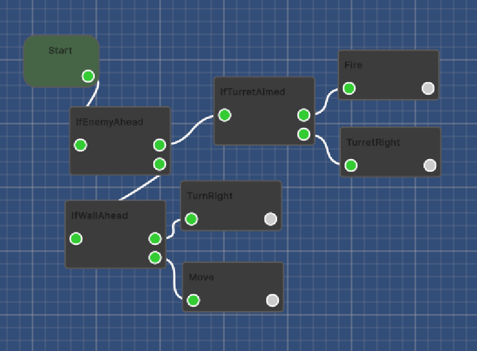
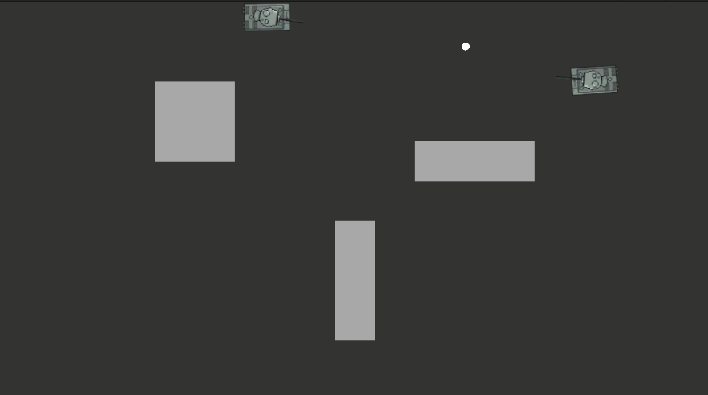

# Tank AI Game

A prototype game where players program tank AI using a node editor.

Inspired by Carnage Heart and Gladiabots.

## Features

- Node-based AI programming system
- Custom node editor built with Unity UI Toolkit
- AI behaviors saved as JSON
- Separate AI for player and enemy tanks
- /*5 vs 5 tank battles*/

## AI System

Players create tank behaviors using nodes such as:

- IfEnemyAhead
- IfTurretAimed
- IfWallAhead
- MoveForward
- TurnLeft / TurnRight
- Fire

The node graph is saved as JSON and executed at runtime.

## Status

🚧 Early Development

## Screenshot

### Node Editor

### Battle

